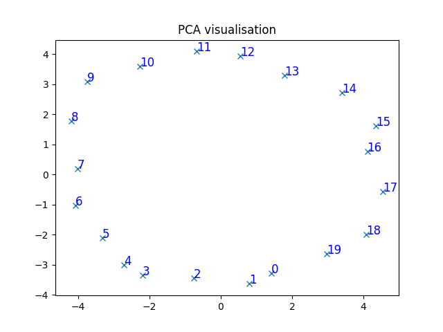

# NLP Huawei (spring 2023)

## Practice 1. Word2Vec

Implementation the Word2Vec algorithm using Skip-Gram and negative sampling. 

<b>Input</b>: given text without punctuation marks, in which all words are separated by one space. 
<b>Output</b>: map where key is the word and value is the desired vector. 

To assess the accuracy of the resulting algorithm, a visualization was made using PCA.  
(In my test case, for 20 different words the PCA graph should tend to a circle) 

